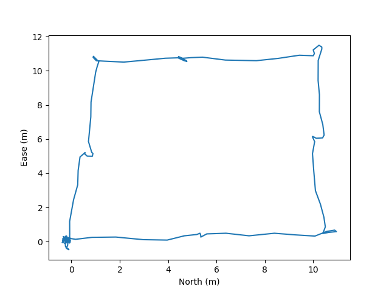
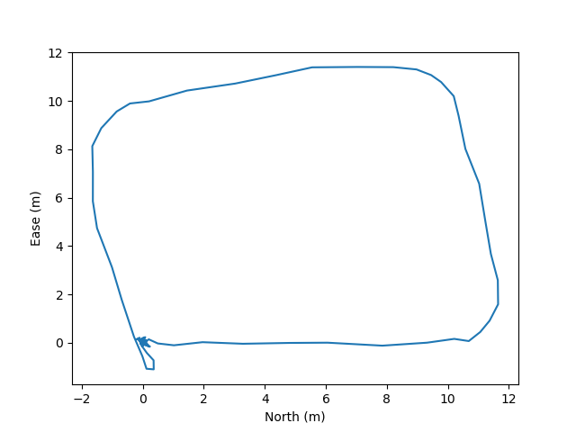

# FCND - Backyard Flyer Project

## 1. Autonomously Flying

```bash
python backyard_flyer.py --route_size 10 --route_altitude 3
```


## 2. Manually Flying Trajectory

```bash
python plot_trajectory.py --logfile Logs/TLog-manual.txt --output Logs/trajectory_manually_flying.png
```
<div align='center'>
    
</div>

## 3. Autonomously Flying Trajectory

```bash
python plot_trajectory.py --logfile Logs/TLog.txt --output Logstrajectory_autonomously_flying.png
```
<div align='center'>
    
</div>