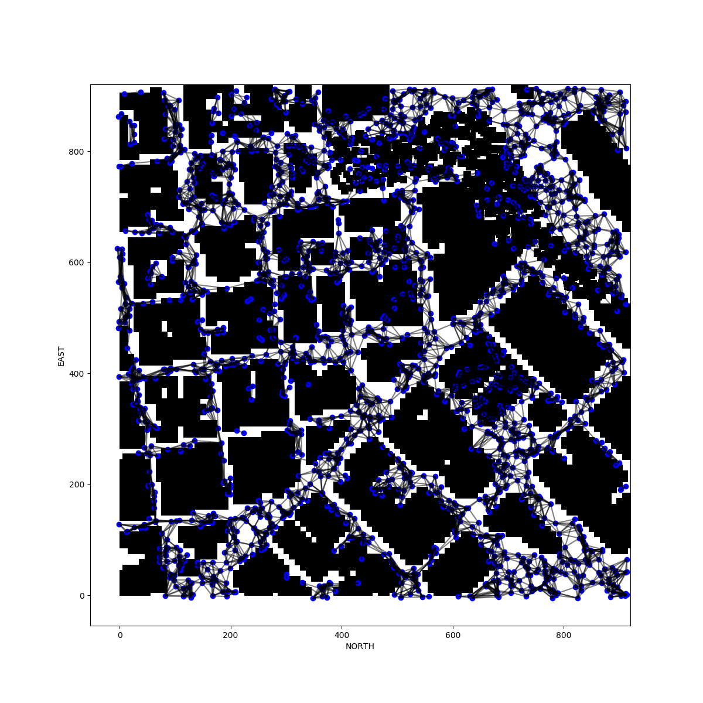
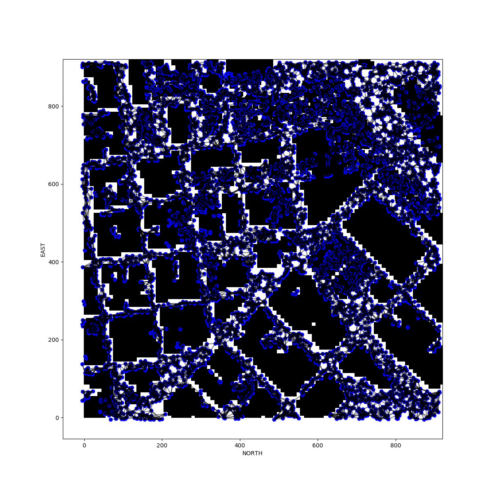
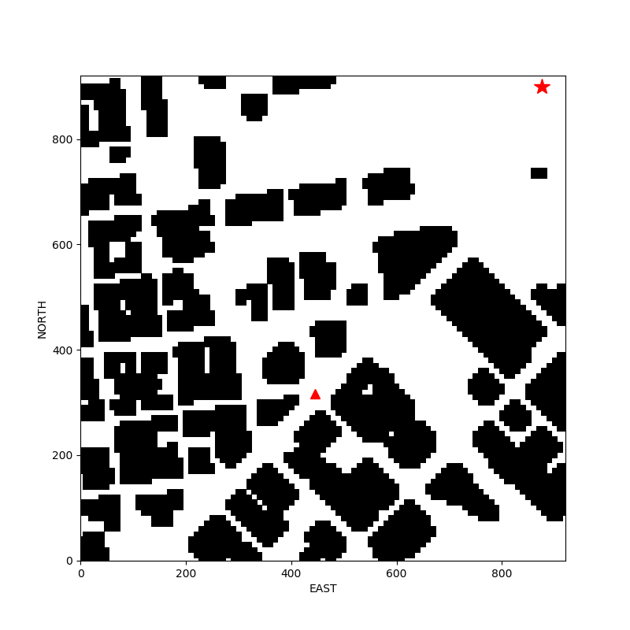

## Project: 3D Motion Planning

### Required Steps for a Passing Submission ([Rubric](https://review.udacity.com/#!/rubrics/1534/view) Points):
- [x] Load the 2.5D map in the colliders.csv file describing the environment.
- [x] Discretize the environment into a grid or graph representation.
- [x] Define the start and goal locations.
- [x] Perform a search using A* or other search algorithm.
- [x] Use a collinearity test or ray tracing method (like Bresenham) to remove unnecessary waypoints.
- [x] Return waypoints in local ECEF coordinates (format for `self.all_waypoints` is [N, E, altitude, heading], where the drone’s start location corresponds to [0, 0, 0, 0].
- [x] Write it up.


---
### Writeup / README

#### 1. Provide a Writeup / README that includes all the rubric points and how you addressed each one.  You can submit your writeup as markdown or pdf.
You're reading it! Below I describe how I addressed each rubric point and where in my code each point is handled.


### Explain the Starter Code

#### 1. Explain the functionality of what's provided in `motion_planning.py` and `planning_utils.py`

[`motion_planning.py`](https://github.com/thhuang/Motion-Planning-Project/blob/master/motion_planning.py) is implemented with a event-driven code similar to [`backyard_flyer.py`](https://github.com/thhuang/Backyard-Flyer-Project/blob/master/backyard_flyer.py).
Morever, a planning state is added to automatically generate waypoints.


Functions and classes for path planning are written in [`planning_utils.py`](https://github.com/thhuang/Motion-Planning-Project/blob/master/planning_utils.py).
Since the planning algorithm is based on the graph search, nodes should be sampled before constructing the graph.
In order to speed up the process, the graph (Fig 1) will be generated only once from the 2.5D map and be reused every inference.

<div align = 'center'>
    
    
</div>
<p align = 'center'>
    Fig 1: A graph with 2000 nodes (left) and a graph with 6000 nodes (right).
</p>


In the planning state, current local position of the drone is determined as the starting position; the goal position is randomly sampled from the free space in the 2.5D map (Fig 2).
A*, a search algorithm, is used for searching path through nodes in the graph (Fig 3 left).
Finally, the path is pruned to get final waypoints (Fig 3 right).
After planning, the drone will take off, go through waypoints, and fly to the goal.

<div align='center'>
    
</div>
<p align = 'center'>
    Fig 2: An example of the start position (triangle) and the goal position (star).
</p>


<div align='center'>
    
    
</div>
<p align = 'center'>
    Fig 3: Path waypoints before (left) and after (right) pruned.
</p>


### Implementing Your Path Planning Algorithm

#### 1. Set your global home position

Since the pre-determined global home position is written in the first line of [`colliders.csv`](https://github.com/thhuang/Motion-Planning-Project/blob/master/colliders.csv#L1), 
[`get_global_home`](https://github.com/thhuang/Motion-Planning-Project/blob/master/planning_utils.py#L195-L200) can extracts the coordinate from it and returns with an altitude combined (default altitude is 0.0).

```python
def get_global_home(map_name, alt0=0.0):
    with open(map_name, 'r') as file:
        lat0, lon0 = re.findall(r'-?[1-9]\d*\.?\d*', file.readline())

    global_home = [float(lon0), float(lat0), alt0]
    return global_home
```

Next, the global home is set with [`set_home_position`](https://github.com/udacity/udacidrone/blob/master/udacidrone/drone.py#L412-L418).

```python
global_home = pu.get_global_home(self.map_name)
self.set_home_position(global_home[0], global_home[1], global_home[2])
```


#### 2. Set your current local position

Current local position can be calculated from current global position and global home with [`global_to_local`](https://github.com/udacity/udacidrone/blob/master/udacidrone/frame_utils.py#L9-L20).

```python
current_global_position = [self._longitude, self._latitude, self._altitude]
current_local_position = global_to_local(current_global_position, self.global_home)
```

#### 3. Set grid start position from local position

The grid start position is set to the integer list format of the current local position.

```python
start_position = [int(coord) for coord in self.local_position]
```

#### 4. Set grid goal position from geodetic coords

The grid goal position may be set with command line arguments.
```bash
python motion_planning.py --goal_lon -122.394150 --goal_lat 37.797433 --goal_alt 10.0
```

The goal altitude is optional, and the default altitude is 5.0.
```bash
python motion_planning.py --goal_lon -122.394150 --goal_lat 37.797433
```

The global goal position will be converted to local goal position.
If the goal position is not specified, the program will randomly pick a free position in the 2.5D map!
```python
if self.goal_position is None:
    goal_position = pu.random_sample(data, polygons, num_samples=1, zmax=MAX_ALTITUDE).ravel()
else:
    goal_local_position = global_to_local(self.goal_position, self.global_home)
    goal_position = [int(coord) for coord in goal_local_position]
```


#### 5. Modify A* to include diagonal motion (or replace A* altogether)

[`Action`](https://github.com/thhuang/Motion-Planning-Project/blob/master/planning_utils.py#L16-L40) class is extended with four diagonal directions which have a cost of sqrt(2).
[`valid_action`](https://github.com/thhuang/Motion-Planning-Project/blob/master/planning_utils.py#L63-L92) function is also extended to check whether the diagonal motion is valid.
Thus A* for grid search ([`a_star_grid`](https://github.com/thhuang/Motion-Planning-Project/blob/master/planning_utils.py#L95-L144)) is able to search for a diagonal path.


Furthermore, A* for graph search ([`a_star_graph`](https://github.com/thhuang/Motion-Planning-Project/blob/master/planning_utils.py#L147-L188)) is implemented to generate probabilistic roadmap.


#### 6. Cull waypoints 

By roughly examine whether two nodes in the path can be connected without crossing any obstacle (polygon), the final waypoints are culled from the pruned path.
```python
def prune_path(polygons, path):
    print('Pruning the path ...')

    pruned_path = [p for p in path]

    # prune the path!
    i = 0
    while i < len(pruned_path) - 2:
        p1 = pruned_path[i]
        p3 = pruned_path[i + 2]
        if can_connect(polygons, p1, p3):
            pruned_path.remove(pruned_path[i + 1])
        else:
            i += 1
    return pruned_path
    
    
def can_connect(polygons, n1, n2):
    line = LineString((n1[0:2], n2[0:2]))
    for poly in polygons:
        if min(n1[2], n2[2]) < poly.height and poly.crosses(line):
            return False
    return True
```


### Execute the flight

#### 1. Does it work?
```bash
python motion_planning.py
```
<div align='center'>
    
</div>
